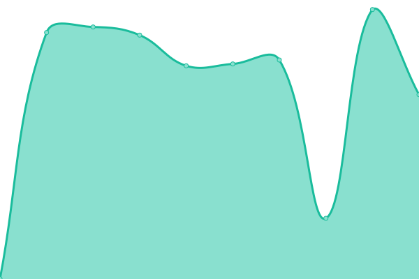

# [📈 Live Status](https://status.datenshi.pw): <!--live status--> **🟩 All systems operational**

This repository contains the open-source uptime monitor and status page for [DATENSHI](https://datenshi.pw), powered by [Upptime](https://github.com/upptime/upptime).

With [Upptime](https://upptime.js.org), you can get your own unlimited and free uptime monitor and status page, powered entirely by a GitHub repository. We use [Issues](https://github.com/osu-datenshi/upptime/issues) as incident reports, [Actions](https://github.com/osu-datenshi/upptime/actions) as uptime monitors, and [Pages](https://status.datenshi.pw) for the status page.

<!--start: status pages-->
<!-- This summary is generated by Upptime (https://github.com/upptime/upptime) -->
<!-- Do not edit this manually, your changes will be overwritten -->
<!-- prettier-ignore -->
| URL | Status | History | Response Time | Uptime |
| --- | ------ | ------- | ------------- | ------ |
|  [osu! Datenshi Website](https://osu.datenshi.pw) | 🟩 Up | [osu-datenshi-website.yml](https://github.com/osu-datenshi/upptime/commits/HEAD/history/osu-datenshi-website.yml) | 

 1144ms
     
 | 

<a href="https://status.datenshi.pw/history/osu-datenshi-website">99.85%</a>
    

|  [osu! Datenshi Multiplayer Site](https://multi.datenshi.pw) | 🟩 Up | [osu-datenshi-multiplayer-site.yml](https://github.com/osu-datenshi/upptime/commits/HEAD/history/osu-datenshi-multiplayer-site.yml) | 

 924ms
     
 | 

<a href="https://status.datenshi.pw/history/osu-datenshi-multiplayer-site">100.00%</a>
    

|  [Datenshi Portal](https://datenshi.pw) | 🟩 Up | [datenshi-portal.yml](https://github.com/osu-datenshi/upptime/commits/HEAD/history/datenshi-portal.yml) | 

 344ms
     
 | 

<a href="https://status.datenshi.pw/history/datenshi-portal">99.87%</a>
    

|  [Content Delivery Network](https://cdn.datenshi.pw) | 🟩 Up | [content-delivery-network.yml](https://github.com/osu-datenshi/upptime/commits/HEAD/history/content-delivery-network.yml) | 

 459ms
     
 | 

<a href="https://status.datenshi.pw/history/content-delivery-network">100.00%</a>
    

|  [Minecraft Datenshi Website](https://mc.datenshi.pw) | 🟩 Up | [minecraft-datenshi-website.yml](https://github.com/osu-datenshi/upptime/commits/HEAD/history/minecraft-datenshi-website.yml) | 

 991ms
     
 | 

<a href="https://status.datenshi.pw/history/minecraft-datenshi-website">99.87%</a>
    

|  [Datenshi Pterodactyl](https://panel.datenshi.pw) | 🟩 Up | [datenshi-pterodactyl.yml](https://github.com/osu-datenshi/upptime/commits/HEAD/history/datenshi-pterodactyl.yml) | 

 917ms
     
 | 

<a href="https://status.datenshi.pw/history/datenshi-pterodactyl">99.88%</a>
    

|  [Datenshi Assets](https://assets.datenshi.pw) | 🟩 Up | [datenshi-assets.yml](https://github.com/osu-datenshi/upptime/commits/HEAD/history/datenshi-assets.yml) | 

 473ms
     
 | 

<a href="https://status.datenshi.pw/history/datenshi-assets">99.88%</a>
    

|  [Datenshi Admin Panel](https://old.datenshi.pw) | 🟩 Up | [datenshi-admin-panel.yml](https://github.com/osu-datenshi/upptime/commits/HEAD/history/datenshi-admin-panel.yml) | 

 902ms
     
 | 

<a href="https://status.datenshi.pw/history/datenshi-admin-panel">99.88%</a>
    

|  [IP Backend](https://ip.datenshi.pw) | 🟩 Up | [ip-backend.yml](https://github.com/osu-datenshi/upptime/commits/HEAD/history/ip-backend.yml) | 

 894ms
     
 | 

<a href="https://status.datenshi.pw/history/ip-backend">99.89%</a>
    

|  [MeguminAPI](https://storage.datenshi.pw) | 🟩 Up | [megumin-api.yml](https://github.com/osu-datenshi/upptime/commits/HEAD/history/megumin-api.yml) | 

 1502ms
     
 | 

<a href="https://status.datenshi.pw/history/megumin-api">99.51%</a>
    

|  [osu! Datenshi API](194.233.65.131) | 🟩 Up | [osu-datenshi-api.yml](https://github.com/osu-datenshi/upptime/commits/HEAD/history/osu-datenshi-api.yml) | 

 201ms
     
 | 

<a href="https://status.datenshi.pw/history/osu-datenshi-api">100.00%</a>
    

|  [osu! Datenshi Bancho](194.233.65.131) | 🟩 Up | [osu-datenshi-bancho.yml](https://github.com/osu-datenshi/upptime/commits/HEAD/history/osu-datenshi-bancho.yml) | 

 201ms
     
 | 

<a href="https://status.datenshi.pw/history/osu-datenshi-bancho">100.00%</a>
    

|  [osu! Datenshi Avatar](194.233.65.131) | 🟩 Up | [osu-datenshi-avatar.yml](https://github.com/osu-datenshi/upptime/commits/HEAD/history/osu-datenshi-avatar.yml) | 

 201ms
     
 | 

<a href="https://status.datenshi.pw/history/osu-datenshi-avatar">100.00%</a>
    

|  [Minecraft Datenshi x Loebad](194.233.65.131) | 🟩 Up | [minecraft-datenshi-x-loebad.yml](https://github.com/osu-datenshi/upptime/commits/HEAD/history/minecraft-datenshi-x-loebad.yml) | 

 203ms
     
 | 

<a href="https://status.datenshi.pw/history/minecraft-datenshi-x-loebad">100.00%</a>
    

<!--end: status pages-->

[**Visit our status website →**](https://status.datenshi.pw)

## 📄 License

- Powered by: [Upptime](https://github.com/upptime/upptime)
- Code: [MIT](./LICENSE) © [DATENSHI](https://datenshi.pw)
- Data in the `./history` directory: [Open Database License](https://opendatacommons.org/licenses/odbl/1-0/)
